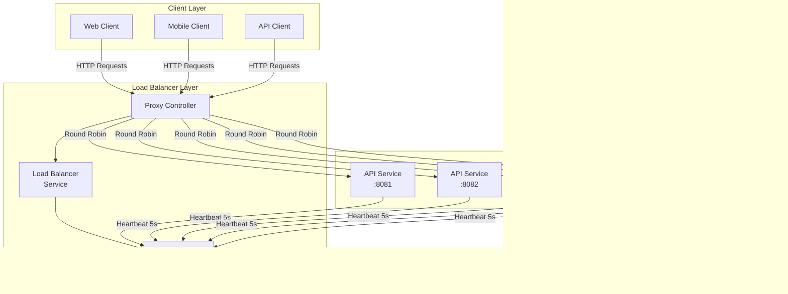

# Spring Boot Load Balancer Demo

A demonstration of a simple but functional load balancer implementation using Spring Boot, showcasing service discovery, health checking, and round-robin load distribution.

## Architecture

The system consists of three main components:



## Features

- Round-robin load balancing
- Dynamic service registration
- Automatic health checking
- Request forwarding for all HTTP methods
- Docker support
- Spring Boot Actuator integration
- Modular architecture

## Tech Stack

- Java 21
- Spring Boot 3.2.0
- Docker & Docker Compose
- Maven
- Project Lombok
- Spring Boot Actuator

## Project Structure

```
.
├── api-service/               # API service module
├── common/                   # Shared DTOs and utilities
├── load-balancer/           # Load balancer core module
├── docker-compose.yml       # Docker composition
└── pom.xml                  # Parent POM file
```

### Modules

1. **load-balancer**: Core load balancing functionality
    - Load balancing service
    - Health checking
    - Request proxying

2. **api-service**: Demo service for testing
    - Simple REST endpoints
    - Health reporting
    - Multiple instance support

3. **common**: Shared components
    - DTOs
    - Exceptions
    - Common utilities

## Getting Started

### Prerequisites

- Java 21 JDK
- Docker and Docker Compose
- Maven 3.9+

### Building the Project

```bash
# Clone the repository
git clone [repository-url]

# Build with Maven
./mvnw clean package

# Build with Docker Compose
docker-compose build
```

### Running the Application

```bash
# Start all services using Docker Compose
docker-compose up

# Or start individual components with Maven
./mvnw spring-boot:run -pl load-balancer
./mvnw spring-boot:run -pl api-service
```

### Configuration

#### Load Balancer (application.yml)
```yaml
server:
  port: 8080

spring:
  application:
    name: load-balancer

management:
  endpoints:
    web:
      exposure:
        include: health,info,metrics
```

#### API Service (application.yml)
```yaml
server:
  port: ${SERVER_PORT:8081}

loadbalancer:
  url: ${LOADBALANCER_URL:http://localhost:8080}
```

## Testing

### Manual Testing

1. Start the services:
```bash
docker-compose up
```

2. Send requests to the load balancer:
```bash
curl http://localhost:8080/api/demo
```

3. Monitor distribution of requests across services in the logs.

### Health Check Testing

1. Monitor service health:
```bash
curl http://localhost:8080/actuator/health
```

2. View registered services:
```bash
curl http://localhost:8080/actuator/metrics
```

## Docker Support

The project includes Dockerfile for each service and a docker-compose.yml for orchestration. To run with Docker:

```bash
# Build and start all services
docker-compose up --build

# Scale API services
docker-compose up --scale api-service=5

# Stop all services
docker-compose down
```

## Monitoring

The application exposes several endpoints through Spring Boot Actuator:

- `/actuator/health`: Health information
- `/actuator/info`: Application information
- `/actuator/metrics`: Metrics data

## Implementation Details

### Load Balancing Algorithm

The load balancer uses a round-robin algorithm implemented with an AtomicInteger:

```java
public ServiceNode getNextAvailableNode() {
    List<ServiceNode> healthyNodes = serviceNodes.values().stream()
            .filter(ServiceNode::healthy)
            .toList();

    if (healthyNodes.isEmpty()) {
        throw new IllegalStateException("No healthy nodes available");
    }

    int index = currentNodeIndex.getAndIncrement() % healthyNodes.size();
    return healthyNodes.get(index);
}
```

### Health Checking

Services send heartbeats every 5 seconds, and nodes are considered unhealthy after 30 seconds of no heartbeat:

```java
@Scheduled(fixedRate = 10000) // Check every 10 seconds
public void checkNodeHealth() {
    Instant threshold = Instant.now().minus(HEALTH_CHECK_TIMEOUT_SECONDS, 
            ChronoUnit.SECONDS);

    loadBalancerService.getAllNodes().stream()
            .filter(node -> node.lastHeartbeat().isBefore(threshold))
            .forEach(node -> loadBalancerService.removeNode(node.serviceId()));
}
```

## Contributing

1. Fork the repository
2. Create a feature branch
3. Commit your changes
4. Push to the branch
5. Create a Pull Request

## Future Improvements

- Weighted round-robin support
- Least connections algorithm
- Sticky sessions
- Circuit breaker implementation
- Rate limiting
- Enhanced metrics and monitoring
- Configuration UI
- SSL/TLS support
- Custom health check endpoints

## License

This project is licensed under the Apache License 2.0 - see the LICENSE file for details.